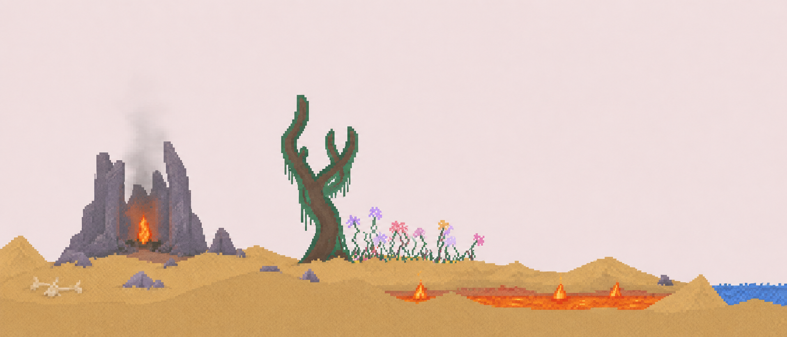

# Vivum - пиксельная песочница с различными частицами



Браузерная симуляция сыпучих тел. Сыпь песок, лей воду, поджигай, замораживай и наблюдай за физикой частиц в реальном времени.

---

## Как это работает

1. Запускается загрузочный экран
2. Появляется рабочий стол
3. Двойной клик по иконке Vivum открывает симуляцию
4. Выбираешь элемент на панели инструментов и рисуешь мышью
5. Частицы падают и физически взаимодействуют друг с другом

---

## Функции

- **Загрузочный экран** - анимация с прогресс-баром
- **Рабочий стол** - пиксельные обои, иконки, таскбар и часы
- **Меню пуск** - открытие игры, пресеты и быстрое сохранение
- **Физика частиц** - 19 элементов с уникальным поведением
- **Пресеты** - готовые сцены: Вулкан, Ледник, Оазис и Каскад
- **Быстрое сохранение** - сохранение и восстановление состояния холста
- **Размер кисти** - 5 размеров от крошечного до огромного
- **Звуки** - звуки системы и взаимодействия элементов
- **Пауза / Отмена** - пауза симуляции и отмена последнего действия

---

## Элементы

| Элемент   | Поведение                                        |
|-----------|--------------------------------------------------|
| Sand      | Сыпется и собирается горкой                      |
| Water     | Течёт и заполняет пространство                   |
| Fire      | Горит и поджигает дерево, нефть и прочее         |
| Lava      | Горячая жидкость, поджигает и твердеет в воде    |
| Ice       | Замораживает воду и тает от огня и лавы          |
| Wood      | Твёрдое, горит от огня                           |
| Vine      | Растёт при контакте с водой                      |
| Oil       | Горючая жидкость, легче воды                     |
| Seed      | Прорастает в цветок при контакте с водой         |
| Mold      | Разрастается и поглощает органику                |
| Gas       | Поднимается вверх и воспламеняется               |
| Stone     | Твёрдый элемент, падает                          |
| Brick     | Статичный строительный блок                      |
| Dust      | Мелкие частицы, горят от огня                    |
| Termite   | Поедает дерево и другие органические материалы   |
| Acid      | Разъедает большинство элементов                  |
| Rocket    | Летит вверх и оставляет след                     |
| Spawner   | Непрерывно клонирует соседний элемент            |
| Eraser    | Стирает частицы                                  |

---

## Стек

### Интерфейс
- HTML / CSS / JavaScript - без фреймворков
- CSS-анимации - загрузочный экран и переходы
- Web Audio API - все звуки генерируются программно

### Физика
- WebAssembly - движок симуляции частиц
- Canvas API - рендеринг симуляции в реальном времени

---

## Запуск

```bash
git clone https://github.com/Joehawkk/vivum.git
cd vivum
npx serve .
```

Открой `http://localhost:3000` в браузере.

> Требуется локальный веб-сервер - WASM не работает по `file://`

---

## Структура

```
vivum/
├── index.html          # Точка входа - весь OS-интерфейс
├── banner.png          # Баннер для GitHub
├── css/
│   └── style.css       # Стили OS-интерфейса
├── js/
│   ├── boot.js         # Загрузочный экран и открытие окна
│   ├── vivum-chrome.js # Окно, таскбар, меню Пуск, часы
│   ├── vivum-ui.js     # Панель элементов и кисти
│   ├── presets.js      # Готовые сцены
│   ├── sounds.js       # Звуки (Web Audio API)
│   └── dialog.js       # XP-диалог подтверждения
├── assets/
│   └── bliss.jpg       # Фото для пиксельных обоев
└── engine/
    ├── core.js         # Ядро симуляции
    └── vivum.module.wasm
```
